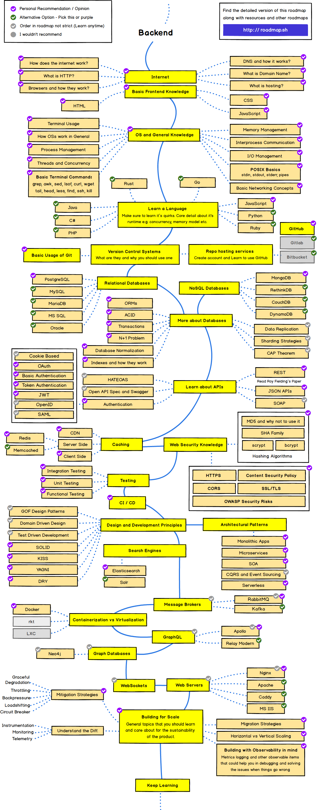

> Roadmap to becoming a software engineer in 2020

Below, you will find a set of graphs demonstrating the paths you can follow and
the technologies you would like to adopt to become a software engineer. I made
these tables to share my university studies and the work people have been doing;
and I want to share them here to help the community.

***

<h3 align="center"><strong>Purpose of these Roadmaps</strong></h3>

> The purpose of these roadmaps is to become a comprehensive software engineer or an expert in the field you want to work.

<h3 align="center"><strong>Note to Beginners</strong></h3>

> These roadmaps cover everything that is there to learn for the paths listed below. Don't feel overwhelmed, you don't need to learn it all in the beginning if you are just getting started.

***
If you think that these can be improved in any way, please do suggest.

## Introduction

## Frontend Roadmap

## Back-end Roadmap 

## DevOps Roadmap

## 🙌 Contribution

> Have a look at [contribution docs](./contributing.md) for how to update any of the roadmaps

- Open pull request with improvements
- Discuss ideas in issues

## License

Have a look at the [license file](./license) for details

## Misc

* [Credits & Thanks](doc/misc/credits.md)

# Made with :sparkling_heart: by yours truly.
